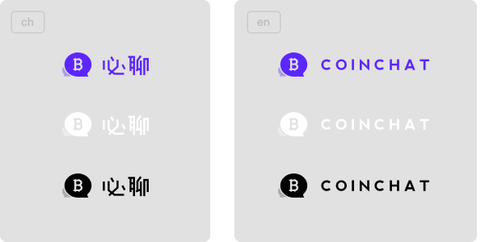

# COINCHAT ICON 文档
## 1. App icon
Coinchat app icon 是必聊官方应用的应用图标，内含有圆角（rounded_corner）和方形（normal）的两种应用图标，分别有48\*48px、96\*96px、144\*144px、192\*192px四个尺寸。

## 2. Coinchat logo
Coinchat logo 是必聊官方的 logo 标识，内含图形icon（logo_icon）、图形与文字组合（logo）两类。

### 1) 图形icon（logo_icon）
内含通常彩色、白色与黑色三个版本的 icon，又分别对应48\*48px、96\*96px、144\*144px、192\*192px四个尺寸。

### 2) 图形与文字组合（logo）
包含中文（ch）与英文（en）的样式组合，分别有彩色、白色与黑色三个类型的 logo 图标。

## 3. 使用规范

1）请不要对 Coinchat app icon 和 Coinchat logo 图形元素进行任何的变形和改造。

2）白色 logo 元素 需要配合深色背景使用；彩色和黑色 logo 元素需要配合浅色背景使用。

